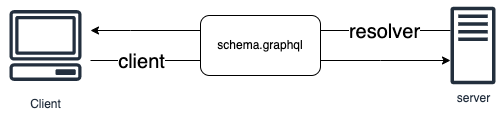

## もくじ
- [GraphQLとは](#GraphQLとは)
- [REATful&#32;APIとの違い](#reatful-apiとの違い)
- [schemaの書き方](#schemaの書き方)
- [実装例](#実装例)
- [触ってみた感想](#触ってみた感想)
- [参考](#参考)


## GraphQLとは
facebookによって作成されたWebAPI仕様 → RESTful APIやSOAP(gRPC)といった通信時のAPIのルールのひとつ

## REATful APIとの違い
### RESTful API
- URLと操作対象が一対一の関係
- HTTPメソッドによって操作が決まる
- application/jsonでのやりとり
- ドキュメントでのリクエスト・レスポンスの仕様管理

### GraphQL
- URLが一つに対して操作対象が複数
- HTTPメソッドはpostのみ
- application/jsonの他にapplication/graphqlもある
- schemaによるリクエスト・レスポンスの仕様管理

## schemaの書き方
以下の構成からなるschemaを作成する。
- type
- query
- mutation
### type
GraphQLで扱うデータのschemaを定義する。

```graphql
type Post {
  id: Int!
  title: String!
  content: String
}

type Query

type Mutatio
```

### query
GraphQLで扱うデータを取得するためのschemaを定義する。

```graphql
extend type Query {
    getPostAll: [Post]!
    getPostById(id: Int!): Post
}
```

### mutation
GraphQLで扱うデータを操作するためのschemaを定義する。

```graphql
extend type Mutation {
  deletePost(id: Int!): Boolean!
}
```

## 実装例
全体構成の雰囲気は以下のようなかんじです。schema.graphqlの実装をサーバー側はresolverによって行い、クライアント側はclientによって行っています。
<br>


※ 今回のサンプルではexpressでの実装を行っています。また、具体的な実装はgraphql code generatorで自動作成しています。

### graphql code generator
graphql code generatorのよってschemaから自動的にリゾルバとクライアントを作成してくれます。

### サーバーの設定
codegen.ymlを作成する。
```yml
overwrite: true
schema: "../schema/**/*.graphql"
documents: null
generates:
  src/generated/graphql.ts:
    config:
      useIndexSignature: true
    plugins:
      - "typescript"
      - "typescript-resolvers"
      - "typescript-operations"

```
codegen.ymlを作成したら、コマンドからリゾルバで扱う型定義を自動生成します。

```shell
$ yarn graphql-codegen --config codegen.yml
```

### リクエストしてみる
GraphQLではエンドポイントは一つのみです。
```
http://localhost:4000/graphql
```

## 触ってみた感想
- schemaさえ作成してしまえば、フロントエンド・バックエンドの実装順序による依存がなくなってとても良い。
- エンドポイントが一つなので、複数クライアントがある場合等ではURLの管理が楽に感じた。
- エコシステムがとても強力
  - typescriptでの実装の場合、schemaで扱うデータの型補完がよく効くので実装がとても楽だった。
  - バックエンド・フロントエンド両方に対してリクエスト・レスポンスで必要な型定義をschemaから自動生成してくれてschema変更したあとの対応が少ないように感じた。

## 参考
- GraphQLが解決する問題とその先のユースケース<br>
https://zenn.dev/saboyutaka/articles/07f1351a6b0049
- GraphQL Code Generator で TypeScript の型を自動生成する<br>
https://techlife.cookpad.com/entry/2021/03/24/123214
